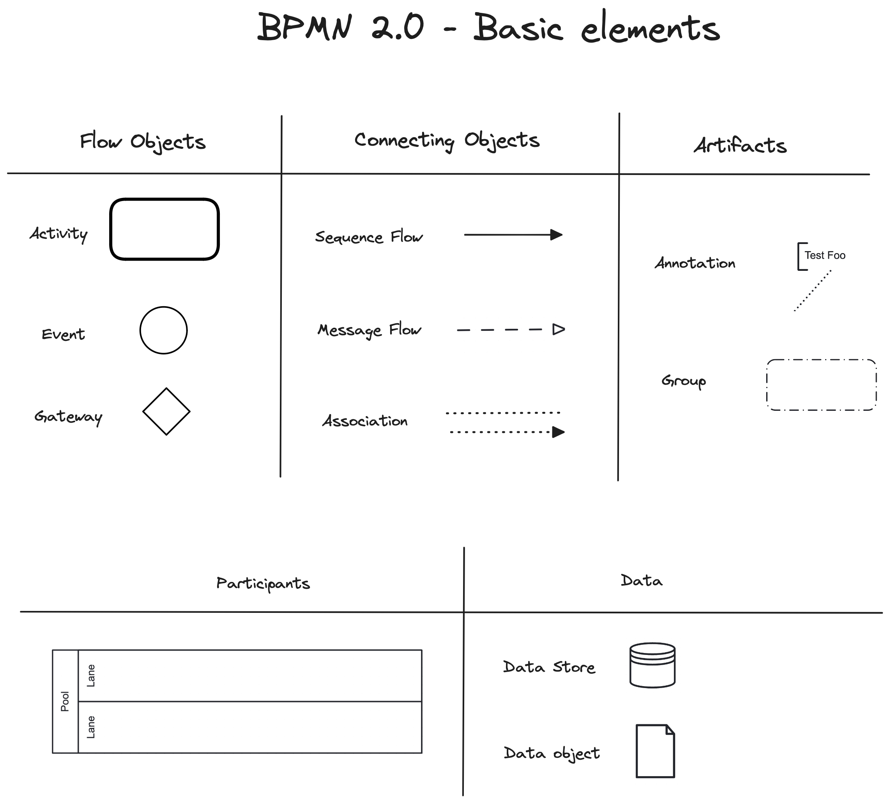

# Chapter1: BPMN 2.0 

## 1. BPMN Learning Video

This Course by Camunda provides you a hands-on Business Process Management and Notation 2.0. The Registration is for free.

- [ ] https://academy.camunda.com/camunda-bpmn

### BPMN 2.0 - Basic Elements:

## 2. Model BPMN 'exam-registration'
As part of the previously studied training video on BPMN, you should be able to transfer the following business 
context into a BPMN2.0 model.  Important: Everyone models a little differently, it is important that you meet 
the requirements in a meaningful way. There is no one right solution.

<ins>Note: At this point, you are talking to the university management. This means that your goal is to model the process
in such a way that it is business correct. At this point, it is not crucial to map specific technical details.</ins>

### Business Context:
We were commissioned by the university management to digitize the exam registration process for students.
For this purpose, we are to model the actual process with which a student can register for a course examination. 
We received the following context from the examination office:

*The Process starts with a request from a student how wants to register for an exam. Next, a person from the examination
office checks whether this student exists. If not, the process is terminated. If the student exists and the
application is submitted within the official examination registration deadline of the examination office, the student
is registered for the examination and informed accordingly. If the examination registration deadline is not met, the
student will be informed that he/she can submit an application in which he/she justifies why his/her late registration
should be accepted. If the student submits this application with reasons, it will be examined by the Examination Office.
If the application is accepted by the examination office, the student will be registered for the examination. 
If the application is rejected, the student will receive a notification that the application has been rejected.*

Note: The 'possible_solution' branch contains a possible solution.