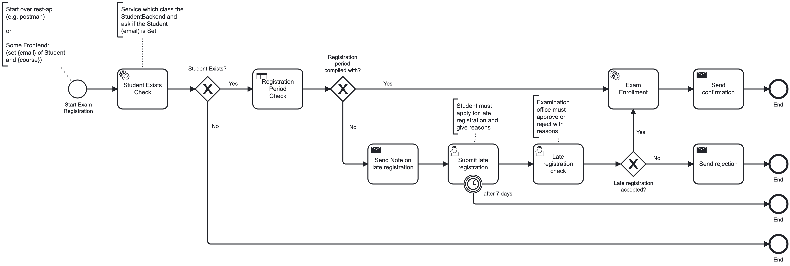
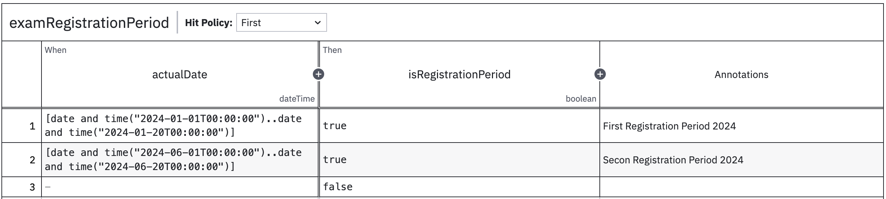

# Chapter2: Camunda 7

## Solution: Camunda 7 Application 'exam-registration'

If you want to try the solution, add the following properties in the `application.properties` file under 
`src/main/resources`:

`spring.mail.host=smtp.office365.com`  
`spring.mail.port=587`  
`spring.mail.username=******`  
`spring.mail.password=******`

`email-client.sendingMailAddress=******`

**Start a Camunda-Prozess with the provided `postman-collection` in the root of the project!**

### BPMN2.0:

### DMN:
